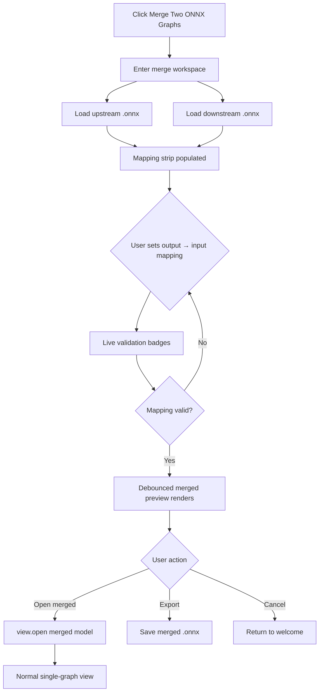
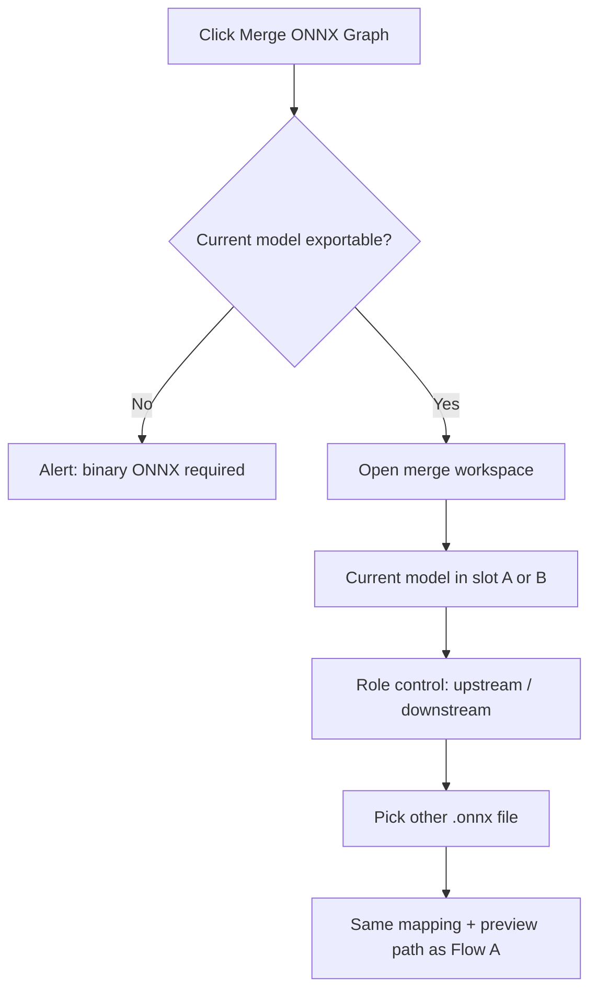
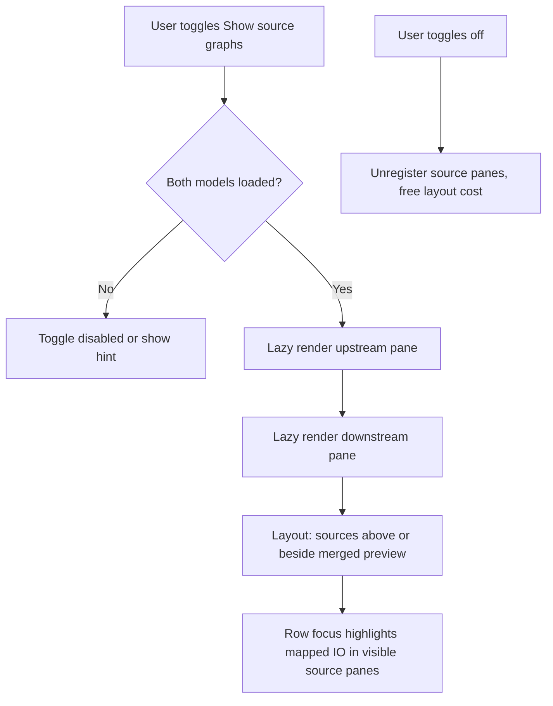
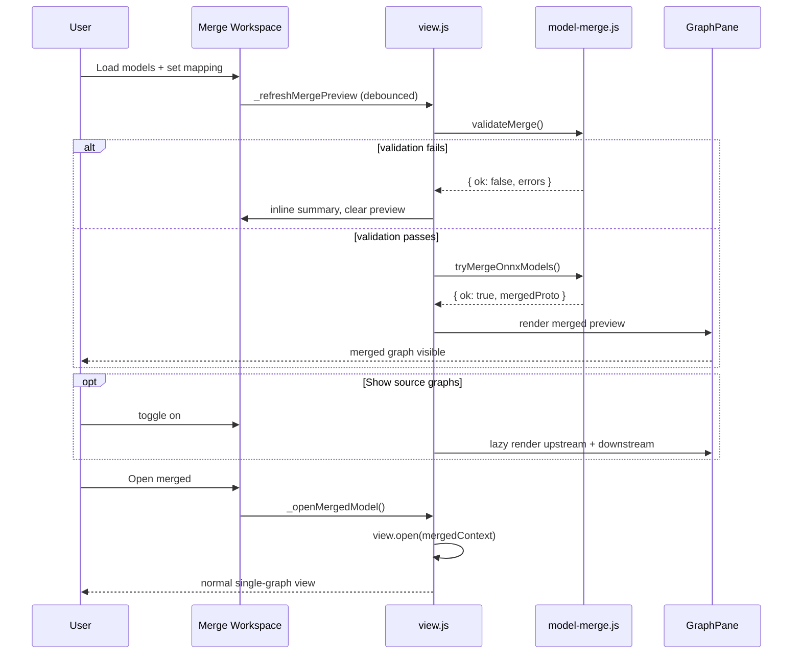

```markdown
# ONNX Graph Merge — Full Feature Plan (v2)

## 1. Overview

### Goal

Allow users to chain two ONNX models by connecting **upstream `graph.output` tensors (sinks)** to **downstream `graph.input` tensors (sources)** via explicit mapping, producing a single merged model:

- **Merged inputs** = upstream model's external `graph.input`
- **Merged outputs** = downstream model's external `graph.output`
- **Junction** = upstream outputs renamed/shared so downstream consumers reference the same tensor names

Data flow direction matters. Visual stacking (which graph appears above another on canvas) does **not**.

### UX Model — Option A (default)

**Merge workspace** (dedicated screen, not a modal):

- **Default:** mapping strip + **live merged preview** (one main graph pane)
- **Optional:** toggle **Show source graphs** → upstream and downstream reference panes (lazy-loaded, read-only)
- **Commit:** **Open merged** → exit merge mode into normal single-model view

Do **not** open three panes automatically on entry.

### Entry Points

| Entry | Label | Behavior |
|-------|-------|----------|
| Welcome screen | **Merge Two ONNX Graphs…** | Opens merge workspace; user loads both models |
| File menu | **Merge ONNX Graph…** | Opens merge workspace; current model pre-loaded in one slot |
| Graph Properties sidebar | **Merge ONNX Graph…** | Same as file menu |

### Hard Rules

1. **Validate before merged preview** — only render merged pane when `validateMerge()` passes (debounced)
2. **Explicit mapping only** — no auto-match by name or position in v1
3. **Binary ONNX only** — requires `model.exportable && model.proto` (same gate as export)
4. **One shared merge pipeline** — all UI paths call the same `model-merge.js` functions
5. **Separate UI mode** — merge workspace is distinct from edit-session `#diff-container` (Original | Modified)
6. **Source graphs are opt-in** — never auto-layout upstream/downstream unless user toggles them on

---

## 2. Terminology

| Term | Meaning |
|------|---------|
| **Upstream** | Model that **produces** boundary outputs (sinks) |
| **Downstream** | Model that **consumes** boundary inputs (sources) |
| **Mapping** | `{ upstream: outputName, downstream: inputName }` — data flows upstream → downstream |
| **Merge workspace** | Full-screen mode (`merge-workspace` body class) for configuring and previewing a merge |
| **Source graphs** | Optional read-only panes showing upstream/downstream models |

Avoid "top/bottom" in UI copy and code identifiers.

---

## 3. User Flows

### Flow A — Welcome Screen



### Flow B — In-app (model already open)




When entering from an open model, pre-fill one slot and expose a **role toggle** (upstream vs downstream). Do not assume the open model is always upstream.

### Flow C — Optional source graphs




### Flow D — Cancel / Dismiss

- **Cancel** in merge workspace → tear down `_mergeSession`, return to welcome or previous open model
- Structural merge failure during preview → show inline summary in mapping strip (preserve mapping state)
- **Open merged** is the only path that calls `view.open()` and exits merge mode

---

## 4. Merge Workspace Layout

### 4.1 Screen modes


| Body class        | Container          | Purpose                                          |
| ----------------- | ------------------ | ------------------------------------------------ |
| `welcome`         | hidden             | Launcher                                         |
| `merge-workspace` | `#merge-container` | Merge configuration + preview                    |
| `default`         | `#diff-container`  | Normal view / edit session (Original | Modified) |


Mutually exclusive: never show `#diff-container` and `#merge-container` at the same time.

### 4.2 Default layout (source graphs off)

```
┌─────────────────────────────────────────────────────────────┐
│  Merge ONNX Graphs                        [ Cancel ]        │
├─────────────────────────────────────────────────────────────┤
│  Model A: backbone.onnx [Browse]   Role: ● Upstream       │
│  Model B: head.onnx     [Browse]         ○ Downstream       │
│                          [ ] Show source graphs             │
├─────────────────────────────────────────────────────────────┤
│  Connection mapping                                       │
│  Upstream output    →    Downstream input    Type   Status│
│  [ conv_out      ▼]      input_1 (fixed)     f32…   ✓     │
│  Summary: ✓ Ready to merge                                │
├─────────────────────────────────────────────────────────────┤
│                                                             │
│                    MERGED PREVIEW (full width)              │
│                    (GraphPane, read-only in v1)             │
│                                                             │
├─────────────────────────────────────────────────────────────┤
│              [ Export merged… ]    [ Open merged ]          │
└─────────────────────────────────────────────────────────────┘
```

### 4.3 Optional layout (source graphs on)

Split the graph area; merged preview remains primary (larger share):

```
┌──────────────────┬──────────────────┐
│    Upstream      │   Downstream     │  ← read-only, lazy
│  (reference)     │   (reference)    │
├──────────────────┴──────────────────┤
│         Merged preview (primary)    │
└─────────────────────────────────────┘
```

Alternative: horizontal `[ Upstream | Downstream | Merged ]` only when toggled — merged pane keeps ≥50% width.

### 4.4 Mapping strip behavior

- **Rows** = one per downstream `graph.input`
- **Columns:**
  - Downstream input name (read-only)
  - Downstream type/shape hint (read-only)
  - Dropdown: upstream outputs
  - Upstream type/shape hint (updates on selection)
  - Status: ✓ compatible, ✗ incompatible, — unselected
- **Live validation:** on every change, call `validateMerge()`; update summary + row badges immediately
- **Live merged preview:** when validation passes, debounce (~400ms) then `tryMergeOnnxModels()` → render merged pane only
- **Open merged enabled when:** both models loaded, all downstream inputs mapped, zero error-level issues (warnings OK — show in summary)
- **Row focus** (optional v1.1): when source graphs visible, highlight mapped output/input in respective panes

### 4.5 Hidden file inputs

```html
<input type="file" id="merge-upstream-file-dialog" class="open-file-dialog" accept=".onnx">
<input type="file" id="merge-downstream-file-dialog" class="open-file-dialog" accept=".onnx">
```

Either slot can browse independently; load order does not imply role.

---

## 5. Core Merge Logic

### 5.1 Data Model

```js
// Mapping entry (explicit, user-defined; data flows upstream → downstream)
{ upstream: string, downstream: string }

// Full merge options
{
  mapping: Array<{ upstream: string, downstream: string }>,
  downstreamPrefix?: string,   // default: 'downstream_' if collisions detected
  strictShapes?: boolean,      // default: true
  allowSymbolicDims?: boolean  // default: false in v1
}

// View merge session (view.js)
{
  upstream:   { model, proto, target, filename } | null,
  downstream: { model, proto, target, filename } | null,
  mapping: Array<{ upstream, downstream }>,
  showSourceGraphs: boolean,
  mergedPreview: { proto, model, target } | null,
  validation: { ok, errors, warnings },
}
```

### 5.2 Pipeline Steps

```
1. Load upstreamProto, downstreamProto (ModelProto)
2. validateMerge(upstreamProto, downstreamProto, mapping)  → errors/warnings
3. prefixDownstreamGraph(downstreamGraph, reservedNames)   → resolve name collisions
4. applyMappingRenames(downstreamGraph, mapping)           → downstream inputs → upstream output names
5. removeMappedDownstreamInputs(downstreamGraph, mapping)  → drop internalized inputs
6. mergeGraphProtos(upstreamGraph, downstreamGraph)        → new GraphProto
7. mergeModelProtos(upstreamProto, downstreamProto, mergedGraph)
8. normalizeGraphReferences + validateGraph                 → structural check
9. Return merged ModelProto
```

### 5.3 Graph Splice Rules


| Field                      | Merged result                                     |
| -------------------------- | ------------------------------------------------- |
| `graph.input`              | Upstream's inputs only                            |
| `graph.output`             | Downstream's outputs only                         |
| `graph.node`               | `[...upstream.node, ...downstream.node]`          |
| `graph.initializer`        | Union of both (after rename/prefix)               |
| `graph.sparse_initializer` | Union of both                                     |
| `graph.value_info`         | Union, dedupe by name (upstream wins on conflict) |
| Mapped downstream inputs   | **Removed** from `graph.input`                    |


### 5.4 Rename / Connect (the splice)

For each mapping `{ upstream: U, downstream: D }`:

1. Rename every reference to `D` in the downstream graph → `U`
  - `node.input`, `node.output`
  - `graph.input`, `graph.output`, `graph.value_info`
  - `initializer.name`, sparse initializer names
  - `quantization_annotation.tensor_name`
2. Remove downstream `graph.input` entry for `D`

After merge, downstream nodes that consumed `D` reference `U`, which upstream nodes produce.

**Reuse:** adapt `renameInGraph()` from `source/onnx-export.js` (lines 235–268).

### 5.5 Name Collision Handling

1. Collect all names in upstream graph (`collectGraphNames` from `onnx-export.js`)
2. For each colliding name in downstream graph → prefix (`downstream_` by default)
3. Mapping refers to **original** downstream input names (before prefix)
4. Order: **prefix first → rename for mapping second**

Report collisions as warnings in validation; auto-prefix at merge time.

### 5.6 ModelProto Merge

```js
mergedModel = {
  ir_version: max(upstream.ir_version, downstream.ir_version),
  opset_import: mergeOpsetImports(upstream, downstream),
  producer_name: 'netron-editor',
  producer_version: '<app version>',
  domain: upstream.domain || downstream.domain,
  model_version: max(upstream.model_version, downstream.model_version),
  doc_string: `Merged: ${upstreamName} + ${downstreamName}`,
  graph: mergedGraph,
  metadata_props: [...upstream.metadata_props, ...downstream.metadata_props],
}
```

---

## 6. Validation Logic

### 6.1 Validation API

```js
export class MergeError extends Error {
  constructor(message, errors = []) {
    super(message);
    this.name = 'Merge Error';
    this.errors = errors;
  }
}

export function validateMerge(upstreamProto, downstreamProto, mapping, options) {
  return { ok: boolean, errors: MergeIssue[], warnings: MergeIssue[] };
}

export function tryMergeOnnxModels(upstreamProto, downstreamProto, options) {
  const validation = validateMerge(...);
  if (!validation.ok) return { ok: false, errors: validation.errors };
  try {
    const mergedProto = mergeModelProtos(...);
    return { ok: true, mergedProto, warnings: validation.warnings };
  } catch (e) {
    return { ok: false, errors: [{ code: 'MERGE_FAILED', message: e.message }] };
  }
}
```

### 6.2 Issue Codes


| Code                            | Severity | Description                                        |
| ------------------------------- | -------- | -------------------------------------------------- |
| `INVALID_MODEL`                 | error    | Missing `graph` or not ModelProto                  |
| `NOT_ONNX`                      | error    | Model not exportable / no proto                    |
| `NO_UPSTREAM_OUTPUTS`           | error    | Upstream graph has no outputs                      |
| `NO_DOWNSTREAM_INPUTS`          | error    | Downstream graph has no inputs                     |
| `UNKNOWN_UPSTREAM_OUTPUT`       | error    | Mapping references missing upstream output         |
| `UNKNOWN_DOWNSTREAM_INPUT`      | error    | Mapping references missing downstream input        |
| `UNMAPPED_DOWNSTREAM_INPUT`     | error    | Downstream input not in mapping                    |
| `DUPLICATE_UPSTREAM_IN_MAPPING` | error    | Same upstream output mapped twice                  |
| `TYPE_MISMATCH`                 | error    | `elem_type` differs                                |
| `RANK_MISMATCH`                 | error    | Different number of dimensions                     |
| `DIM_MISMATCH`                  | error    | Static `dim_value` differs                         |
| `SYMBOLIC_MISMATCH`             | error    | `dim_param` vs `dim_value` conflict                |
| `NON_TENSOR_IO`                 | error    | sequence/map/optional/sparse at boundary           |
| `UNKNOWN_TYPE`                  | error    | Cannot resolve type for boundary tensor            |
| `NAME_COLLISION`                | warning  | Node/initializer/tensor name exists in both        |
| `EXTERNAL_WEIGHTS`              | error    | Initializer uses external data (v1 block)          |
| `CUSTOM_FUNCTIONS`              | warning  | Model has `functions` (v1 skip merge of functions) |
| `DANGLING_REFERENCE`            | error    | Post-merge validateGraph failure                   |


### 6.3 Type Compatibility Check

Boundary types from `**ValueInfoProto.type**` (`TypeProto.tensor_type`).

**Resolution order:**

1. `graph.output` / `graph.input` entry
2. Same name in `graph.value_info`
3. Infer from producer node (upstream output) or first consumer (downstream input)

```js
function areTypesCompatible(upstreamType, downstreamType, options) {
  // 1. Both must be tensor_type (v1)
  // 2. elem_type must match exactly
  // 3. If both shapes known: rank must match
  // 4. For each dim i: if both dim_value → must match
  // 5. If dim_param vs dim_value → fail unless allowSymbolicDims
  // 6. If shape missing on one side → warning, allow merge
}
```

### 6.4 Mapping Rules (v1 strict)

- Every downstream `graph.input` **must** appear exactly once in mapping
- Each upstream output used **at most once** in mapping
- Mapping count ≥ 1
- Unmapped upstream outputs are dropped from merged outputs (expected)

### 6.5 Post-Merge Structural Validation

Reuse from `onnx-export.js`:

- `normalizeGraphReferences(mergedGraph)`
- `validateGraph(mergedGraph)`

---

## 7. View Integration

### 7.1 Reuse existing `GraphPane`

Extend the pattern in `source/graph-pane.js` and `view._renderGraphInPane()`:


| Pane              | Container ID             | When rendered               | readOnly  |
| ----------------- | ------------------------ | --------------------------- | --------- |
| Merged preview    | `#merge-preview-pane`    | Always (when mapping valid) | true (v1) |
| Upstream source   | `#merge-upstream-pane`   | When `showSourceGraphs`     | true      |
| Downstream source | `#merge-downstream-pane` | When `showSourceGraphs`     | true      |


Do **not** reuse `#target-original` / `#target-modified` for merge — those belong to edit session.

### 7.2 Loading models (without `view.open()`)

```js
async _loadModelForMerge(file) {
  const context = new BrowserFileContext(this._host, file, [file]);
  const model = await this._modelFactoryService.open(context);
  if (!model.exportable || !model.proto) {
    throw new MergeError('Only binary .onnx models can be merged.');
  }
  return model;
}
```

Hold `model.proto` and graph `target` in `_mergeSession`. Do not call `view.open()` for source models.

### 7.3 Live merged preview

```js
async _refreshMergePreview() {
  const { upstream, downstream, mapping } = this._mergeSession;
  if (!upstream || !downstream) return;

  const validation = validateMerge(upstream.proto, downstream.proto, mapping);
  this._updateMergeValidationSummary(validation);

  if (!validation.ok) {
    this._clearMergePreviewPane();
    return;
  }

  clearTimeout(this._mergePreviewTimer);
  this._mergePreviewTimer = setTimeout(async () => {
    const result = tryMergeOnnxModels(upstream.proto, downstream.proto, { mapping });
    if (!result.ok) {
      this._clearMergePreviewPane();
      return;
    }
    const model = /* decode mergedProto to in-memory model */;
    const target = /* resolve main graph target */;
    await this._mergePreviewPane.render(target, null, null);
    this._mergeSession.mergedPreview = { proto: result.mergedProto, model, target };
  }, 400);
}
```

### 7.4 Commit actions

```js
async _openMergedModel() {
  const preview = this._mergeSession.mergedPreview;
  if (!preview) return;

  this._teardownMergeWorkspace();
  const context = /* bytes from preview.proto */;
  await this.open(context);
  this._host.document.title = buildMergeFilename(
    this._mergeSession.upstream.filename,
    this._mergeSession.downstream.filename
  );
}

async _exportMergedModel() {
  const preview = this._mergeSession.mergedPreview;
  if (!preview) return;
  const bytes = onnx.ModelProto.encodeBytes(preview.proto);
  // existing save dialog / blob download pattern
}
```

### 7.5 Error display

Inline in mapping strip summary for validation errors. Use `_host.message()` only for unexpected failures (load error, encode failure).

```js
function formatMergeErrors(errors) {
  const lines = ['Cannot merge models.', ''];
  const mapping = errors.filter(e => e.upstream && e.downstream);
  const other = errors.filter(e => !e.upstream || !e.downstream);

  if (mapping.length) {
    lines.push('Mapping issues:');
    for (const e of mapping) {
      lines.push(`• ${e.downstream} ← ${e.upstream}: ${e.message}`);
    }
    lines.push('');
  }
  if (other.length) {
    lines.push('Other issues:');
    for (const e of other) {
      lines.push(`• ${e.message}`);
    }
  }
  return lines.join('\n');
}
```

### 7.6 Welcome screen button

**Location:** `source/index.html`, below "Open Model…"

```html
<button id="merge-onnx-button" class="center logo-button merge-onnx-button">
  Merge Two ONNX Graphs&hellip;
</button>
```

**Wiring:** `browser.js` / `desktop.mjs` → `view._startMergeWorkspace({ presetModel: null })`

### 7.7 File menu & sidebar

```js
{
  label: 'Merge ONNX Graph...',
  execute: async () => await this._startMergeWorkspace({ presetModel: this._model }),
  enabled: () => this._canMergeOnnx()
}

_canMergeOnnx() {
  return this._model && this._model.exportable && this._model.proto;
}
```

Graph Properties sidebar: same button when `_canMergeOnnx()`.

### 7.8 `view.js` additions

```js
_startMergeWorkspace({ presetModel, presetRole })  // entry point
_teardownMergeWorkspace()
_openMergeWorkspace()
_onMergeUpstreamFileSelected(file)
_onMergeDownstreamFileSelected(file)
_onMergeRoleChanged(modelSlot, role)               // upstream | downstream
_onMergeShowSourceGraphsChanged(enabled)
_refreshMergeMappingTable()
_onMergeMappingChanged(rowIndex, upstreamOutputName)
_updateMergeValidationSummary(validation)
_refreshMergePreview()                           // debounced
_clearMergePreviewPane()
_renderMergeSourcePanes()                        // lazy, when toggle on
_openMergedModel()
_exportMergedModel()
_canMergeOnnx()
_loadModelForMerge(file)
```

---

## 8. Module Structure

### 8.1 `source/model-merge.js`

```js
export class MergeError extends Error { ... }

export function extractGraphOutputs(graph) → ValueInfo[]
export function extractGraphInputs(graph) → ValueInfo[]
export function resolveValueType(graph, name) → TypeProto | null
export function formatType(type) → string

export function areTypesCompatible(upstreamType, downstreamType, options) → { ok, reason }
export function validateMapping(upstreamGraph, downstreamGraph, mapping, options) → issues[]

export function prefixDownstreamGraph(downstreamGraph, prefix, reservedNames) → void
export function applyMappingRenames(graph, mapping) → void
export function removeMappedDownstreamInputs(graph, mapping) → void
export function mergeGraphProtos(upstreamGraph, downstreamGraph, options) → GraphProto
export function mergeOpsetImports(upstreamProto, downstreamProto) → OperatorSetIdProto[]
export function mergeModelProtos(upstreamProto, downstreamProto, options) → ModelProto

export function validateMerge(upstreamProto, downstreamProto, mapping, options) → { ok, errors, warnings }
export function tryMergeOnnxModels(upstreamProto, downstreamProto, options) → { ok, mergedProto?, errors?, warnings? }
export function formatMergeErrors(errors) → string
```

### 8.2 `source/index.html` additions

- `#merge-onnx-button` (welcome)
- `#merge-container` with:
  - `#merge-toolbar` (model slots, role controls, source toggle, cancel)
  - `#merge-mapping-strip`
  - `#merge-graph-area` containing `#merge-preview-pane` (+ optional source panes)
  - `#merge-actions` (Export, Open merged)
- Hidden file inputs for upstream/downstream browse
- CSS: `.merge-workspace`, `.merge-container`, `.merge-mapping-strip`, `.merge-preview-pane`

### 8.3 Dependencies (reuse, don't duplicate)


| From                 | Use                                                                                                  |
| -------------------- | ---------------------------------------------------------------------------------------------------- |
| `graph-pane.js`      | `GraphPane` for all merge panes                                                                      |
| `onnx-export.js`     | `cloneModelProto`, `renameInGraph`, `collectGraphNames`, `normalizeGraphReferences`, `validateGraph` |
| `onnx-proto.js`      | `ModelProto`, `GraphProto`, encode/decode                                                            |
| `export-filename.js` | `buildMergeFilename()`                                                                               |
| `onnx.js`            | `model.exportable`, `model.proto`                                                                    |


---

## 9. Filename & Title

```js
function buildMergeFilename(upstreamName, downstreamName) {
  const upstream = stripExtension(basename(upstreamName));
  const downstream = stripExtension(basename(downstreamName));
  return `${upstream}_merged_${downstream}.onnx`;
}
```

Set document title on **Open merged**.

---

## 10. Edge Cases & v1 Scope

### In Scope (v1)

- Merge workspace with mapping strip + live merged preview (default)
- Optional source graph panes (toggle, lazy render)
- Upstream/downstream role assignment + in-app preset model
- Single graph per model (first/main graph only)
- Tensor-type boundaries only
- Explicit 1:1 mapping (one downstream input → one upstream output)
- Auto-prefix on name collision
- Binary in-memory ONNX (no external `.onnx.data`)
- Flat graphs (no If/Loop subgraph merge)
- Export merged from workspace without opening

### Out of Scope (v1 — block or warn)

- External weight files
- Models with `functions`
- Non-tensor I/O (sequence, map, optional)
- Multi-graph models (pick first graph, warn if more exist)
- Auto-mapping by name
- Partial downstream input passthrough (unmapped downstream inputs block merge)
- Click-to-map in source graph panes (dropdown only in v1)
- Editable merged preview / merge-into-edit-session with undo

### Future (v2+)

- Click tensors in source panes to fill mapping dropdowns
- Auto-suggest mapping by name + type match
- Support external data merge
- Open merged directly into edit session (Original | Modified)
- Pin source graphs by default for complex models
- Opset downgrade warnings with checker integration

---

## 11. Testing Plan

### 11.1 Unit tests — `test/model_merge.test.js`


| Test                         | Description                                        |
| ---------------------------- | -------------------------------------------------- |
| `compatible_single_pair`     | 1 output → 1 input, matching float32 [1,3,224,224] |
| `elem_type_mismatch`         | float32 vs float64 → error                         |
| `rank_mismatch`              | [1,768] vs [1,768,1] → error                       |
| `dim_mismatch`               | [1,512] vs [1,768] → error                         |
| `unmapped_downstream_input`  | 2 downstream inputs, 1 mapped → error              |
| `duplicate_upstream_mapping` | same upstream output twice → error                 |
| `name_collision_prefix`      | Conv_1 in both → prefix + success                  |
| `multi_pair_mapping`         | 2 outputs → 2 inputs                               |
| `validate_graph_passes`      | merged result passes validateGraph                 |
| `round_trip_encode`          | merge → encode → decode → node count correct       |


### 11.2 Manual UI tests


| Scenario                    | Expected                                                    |
| --------------------------- | ----------------------------------------------------------- |
| Welcome → merge workspace   | Mapping strip visible; no source panes by default           |
| Load two valid models + map | Merged preview appears after debounce                       |
| Toggle source graphs        | Upstream/downstream panes lazy-render; merged still visible |
| Toggle source graphs off    | Source panes removed; merged preview unchanged              |
| Incompatible types          | No merged preview; inline summary shows errors              |
| Open model → merge          | Preset model in slot; role toggle works                     |
| Current model as downstream | External upstream feeds into open model's inputs            |
| Cancel                      | Returns to previous screen; session cleared                 |
| Export merged               | Saves .onnx without leaving workspace                       |
| Open merged                 | Normal single-graph view; merge workspace torn down         |
| Non-ONNX open model         | Merge menu/sidebar disabled                                 |


---

## 12. Implementation Phases

### Phase 1 — Core logic (no UI)

- [ ] Implement `model-merge.js` full API (upstream/downstream naming)
- [ ] Unit tests for validation + merge
- [ ] Reuse `renameInGraph`, `validateGraph` from onnx-export

### Phase 2 — Merge workspace shell

- [ ] `#merge-container` HTML/CSS + `merge-workspace` screen mode
- [ ] `_mergeSession` state + `_loadModelForMerge`
- [ ] Model slot browse + role controls
- [ ] Mapping strip + live validation badges

### Phase 3 — Live merged preview

- [ ] `#merge-preview-pane` via `GraphPane`
- [ ] Debounced `_refreshMergePreview()`
- [ ] Export merged + Open merged actions

### Phase 4 — Optional source graphs

- [ ] "Show source graphs" toggle
- [ ] Lazy `_renderMergeSourcePanes()`
- [ ] Row-focus highlight (optional polish)

### Phase 5 — Entry points

- [ ] Welcome button (browser + desktop)
- [ ] File menu item
- [ ] Graph Properties sidebar button
- [ ] In-app preset model + role toggle

### Phase 6 — Polish

- [ ] Inline error summary + `formatMergeErrors` for fatals
- [ ] `buildMergeFilename` + title on open
- [ ] Warnings in summary panel
- [ ] Manual QA with real models

---

## 13. Sequence Diagram (end-to-end)




---

## 14. File Change Summary


| File                        | Changes                                                  |
| --------------------------- | -------------------------------------------------------- |
| `source/model-merge.js`     | **New** — merge/validate logic (upstream/downstream API) |
| `source/view.js`            | Merge workspace, session, preview, entry points          |
| `source/index.html`         | Welcome button, `#merge-container`, CSS                  |
| `source/browser.js`         | Welcome button → `_startMergeWorkspace`                  |
| `source/desktop.mjs`        | Same                                                     |
| `source/export-filename.js` | `buildMergeFilename()`                                   |
| `source/graph-pane.js`      | No change expected (reuse as-is)                         |
| `test/model_merge.test.js`  | **New** — unit tests                                     |


---

This document is the single reference for implementing the feature. Switch to **Agent mode** to save this file or start Phase 1.

```

Select all inside the fence above and paste into `merge_UI_plan.md`. Switch to **Agent mode** if you want me to write it to the file directly.
```

