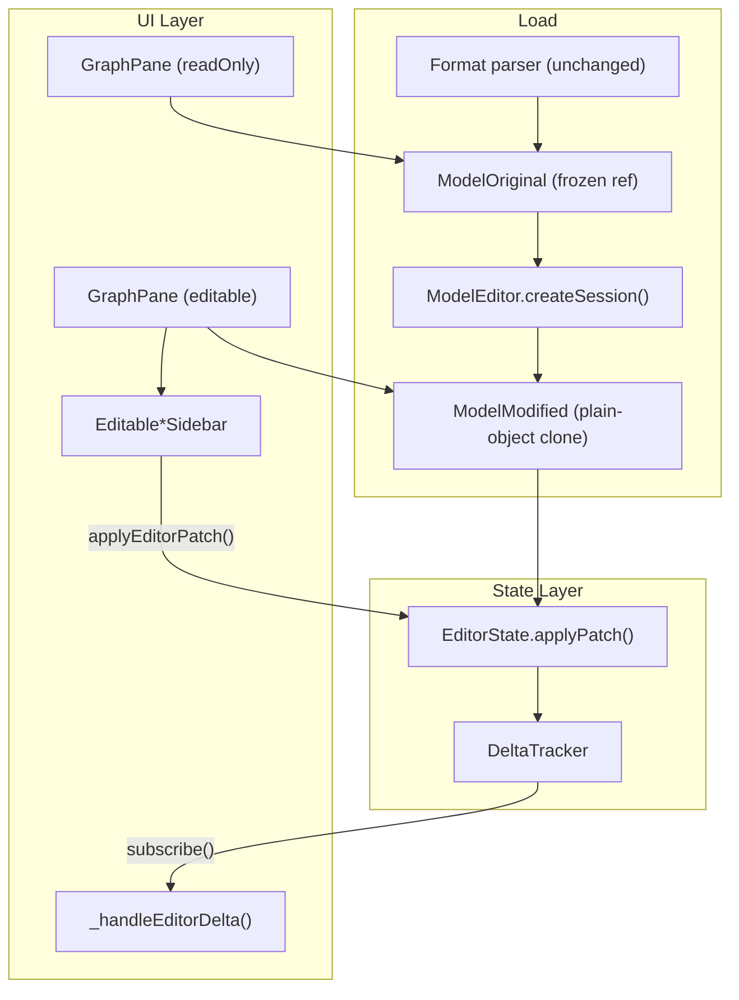

2026-06-08

Tags: 
## 6-8-26 report

### Notes

# Technical Summary: Phases 1–3 (Interactive Graph Editor)

Netron was extended from a read-only ONNX visualizer into a **dual-pane, patch-based editor**. Phase 4 (delta CSS on the graph) is intentionally out of scope here.

---

## Architecture Overview



**Design principle:** Parsers stay untouched. A **plain-object clone** of the view-layer graph is the editable working copy. All writes go through `applyPatch()`; the delta log drives UI refresh.

---

## Phase 1 — State Management (TDD Foundation)

### New modules

| File                                | Role                                                                  |
| ----------------------------------- | --------------------------------------------------------------------- |
| `source/model-editor.js`            | Session creation, structural clone, `applyPatch()`, entity ID helpers |
| `source/delta-tracker.js`           | Change log, per-entity and aggregate state, `subscribe()`             |
| `test/editor_state.test.js`         | 20 unit tests (`npm run test:editor`)                                 |
| `test/fixtures/mock-graph.js`       | 2-node mock with shared value link                                    |
| `test/fixtures/onnx-shaped-mock.js` | Getter-based ONNX-like fixture                                        |

### Core APIs

- **`ModelEditor.createSession(model)`** → `EditorState` with `original`, `modified`, `delta`
- **`EditorState.applyPatch(patch)`** — sole write path; records delta atomically
- **Structural entity IDs:** `graph:0/node:1`, `graph:0/node:1/attr:0`, `graph:0/value:2`
- **`DeltaTracker`:** `record()`, `getState()`, `getAggregateState()`, `getChanges()`, `subscribe()`

### Clone strategy (`readModel()`)

- Deep structural clone of `modules[]` → `nodes`, `attributes`, `inputs`/`outputs`
- **Shared value identity** preserved (same cloned object for producer output / consumer input)
- Getter-based ONNX fields normalized (`node.type.name`, `category`, `module`, `version`)
- Arguments always stored as **`value: []` arrays** (Netron view contract)
- **BigInt** → safe numbers/strings for editing and JSON
- **`visible: false`** preserved on attributes (schema defaults like `group = 1`)
- **`node.type.attributes`** schema preserved for later typed editing

### Patch types implemented

| Entity | Operations |
|--------|------------|
| `node` | `name` modify |
| `attribute` | add, modify, delete |
| `value` | `name`, `type`, `description` modify |

### Integration (Phase 1b)

- `view.View.open()` creates `EditSession` via `ModelEditor.createSession(model)`
- `this._model` continues to point at the **modified** graph for existing code paths
- `window.__debugEditorState()` exposes panes, delta, aggregate states

---

## Phase 2 — Dual-Pane UI

### New module

**`source/graph-pane.js`** — wraps one graph container + `view.Graph` instance, debug state, `[editor]` render logs.

### Layout (`source/index.html`)

```html
#diff-container
  #target-original   (read-only, "Original")
  #pane-divider
  #target-modified   (editable, "Modified")
```

- Independent scroll/zoom per pane (no sync)
- Sidebar width shrinks `#diff-container` instead of a single `#target`

### `view.Graph` refactor

- Pane-scoped DOM: `container`, `_canvas`, `_origin` (no global `#target` / `#canvas`)
- **`markerPrefix`** per pane (`original-arrowhead`, `modified-arrowhead`) — no duplicate SVG IDs
- **`readOnly: true`** on left pane → `activate()` blocked, `[editor] activate blocked: readOnly` logged

### Render flow

- **Left pane:** raw `session.original` graph
- **Right pane:** `session.modified` clone via `_resolveModifiedTarget()`
- Both panes render on navigation; left is static during edits

### Other fixes

- **`source/desktop.mjs`:** titlebar layout uses `#diff-container` (old `#target` removal caused null errors)
- **`test/browser.spec.js`:** updated for `#modified-canvas`

---

## Phase 3 — Editable Sidebar & Edit Loop

### New sidebar hierarchy (`source/view.js`)

```
view.ObjectSidebar
  └── view.EditableObjectSidebar
        ├── view.EditableNodeSidebar
        └── view.EditableConnectionSidebar
```

### Control types

| Component | Purpose |
|-----------|---------|
| `EditableTextView` | Single-line edit; commit on blur/Enter |
| `EditableAttributeView` | Type-aware value parsing; delete button (×) |
| `+ Add Attribute` row | Name + value inputs |

### `EditableNodeSidebar`

- Editable **node name**
- Each attribute: inline value editor + **delete**
- **Add attribute** with schema-aware type resolution
- Commits via `view.applyEditorPatch()` → `EditorState.applyPatch()`

### `EditableConnectionSidebar`

- Editable **tensor Value** metadata: `name`, `type`, `description`
- Edits apply to the shared underlying `Value` (all edges using that tensor update together)
- Read-only **Inputs/Outputs** node lists (same as `ConnectionSidebar`)

### `AttributeSchemaResolver` (`model-editor.js`)

- Looks up ONNX operator schema from `node.type.attributes`
- **`resolveType(nodeType, attrName)`** — e.g. `strides` → `int64[]`
- **`validateName()`** — duplicate name check
- **`parseValue(text, type)`** — shared with `EditableAttributeView`

### Edit → UI pipeline

```
Sidebar commit
  → applyEditorPatch(patch)
    → EditorState.applyPatch()
      → DeltaTracker.record() → subscribe()
        → _handleEditorDelta()
          → sidebar refresh OR lightweight graph node update
          → _ensureDefaultScreen()
```

- **`delta.subscribe()`** centralizes post-edit refresh (not scattered in `applyEditorPatch`)
- **`_refreshOpenNodeSidebar()` / `_refreshOpenConnectionSidebar()`** keep open sidebars in sync

### Incremental graph update (Phase 3 polish)

When **Show Attributes** is on, attribute add/edit/delete uses:

- **`view.Node.rebuildArgumentList()`** — rebuilds only the node’s argument list SVG
- **`view.Graph.refreshNodeArgumentList(modelNode)`** — no full dagre relayout
- Avoids logo spinner and full graph flash

---

## Bugs Found & Fixed (across phases)

| Issue | Cause | Fix |
|-------|-------|-----|
| `group = 1` only on modified pane | Clone dropped `visible: false` | Preserve `visible` in `readAttribute()` |
| Logo overlay / UI blocked after edit | `refresh()` + worker `message()` removed `default` class; `show(null)` closed sidebar | `_ensureDefaultScreen()`; sidebar-only path for most attribute ops |
| New attribute not on graph | Add skipped graph refresh for smooth UX | `rebuildArgumentList()` incremental update |
| BigInt serialize errors | ONNX `int64` attrs | `cloneAttributeValue()`, `stringifyEditorJSON()`, `scalarEqual` |
| Sidebar stale after patch | Full pane rebuild without sidebar refresh | `_refreshOpenSidebars()` + incremental paths |
| `desktop.mjs` null style error | `#target` removed | `#diff-container` + null guards |
| Duplicate SVG marker IDs | Two panes | `markerPrefix` namespacing |

---

## Test Coverage

```bash
npm run test:editor   # 20/20 passing
```

**Suites:** `EditorState`, `ModelAdapter`, `BrowserSafety`

Covers: clone independence, topology/value identity, atomic patch + delta, revert, delete, value edit, schema preservation, visibility, BigInt, browser-safe imports (no `node:` imports in editor modules).

---

## Files Touched (summary)

| Category | Files |
|----------|-------|
| **New** | `model-editor.js`, `delta-tracker.js`, `graph-pane.js`, `test/editor_state.test.js`, fixtures |
| **Modified** | `view.js` (major), `index.html`, `grapher.js` (markerPrefix), `desktop.mjs`, `package.json`, `browser.spec.js` |
| **Unchanged** | Format parsers (`onnx.js`, etc.) — no protobuf round-trip yet |

---

## Explicitly Not Done (Phase 4+)

- Delta CSS classes (`.node-item-modified`, etc.) on graph
- Render hooks wiring `deltaTracker` into `view.Node._add()` / edges
- ONNX serialize/deserialize for save/export
- Undo/redo stack
- Edge rewiring / per-edge edits
- Playwright E2E for edit flows

---

## Verification checklist (manual)

1. Open ONNX model → dual panes render, `__debugEditorState()` works  
2. Left pane: click node → no editable sidebar  
3. Right pane: edit node name, attributes, add/delete attribute  
4. Right pane: click edge → edit connection name/type  
5. Console: `[editor] Patch applied:` + `[editor] Delta updated:`  
6. With Show Attributes: new attrs appear on node box without logo flash  

That’s the full Phase 1–3 scope: **data layer + dual-pane shell + editable sidebar with a working patch/delta loop**, without visual diff styling on the graph yet.
### References