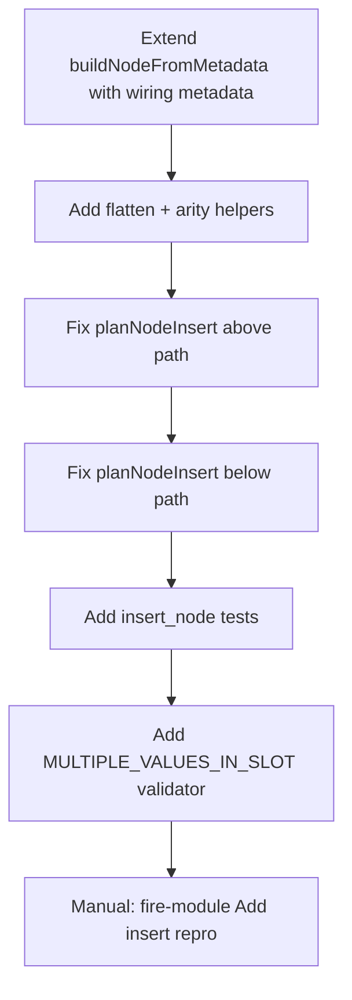

2026-06-16

Tags: [[netron]] [[ambarella]]
## bug - not recognizing multiple inputs in insertions

### Notes
![[Pasted image 20260616112221.png]]
- Shouldn't throw a warning, input just recognized as A
- fire/expand1x1_2 and fire/expand3x3_2 produce two visual edges even though structurally that's one input argument with two values

The bug is localized in planNodeInsert
- a Wiring bug

Here is a concrete fix plan for the `planNodeInsert` wiring bug from [the prior session](814aa88f-755f-4255-b812-38fbadeeadb3).

## Problem summary

The editor models ONNX inputs as **named argument slots**, each with a `value[]` array. Valid **Add** is:

- `A.value = [tensor1]`
- `B.value = [tensor2]`

The bug case has **two tensors in one slot**:

- `A.value = [fire2/expand1x1_2, fire2/expand3x3_2]`
- `B.value = []`

The grapher draws **one edge per tensor in `value[]`**, so the graph looks like two inputs. Properties and validation count **connected slots**, so they correctly report only one input — the warning is right; the insert wiring is wrong.

Root cause in `planNodeInsert` (above path):

```429:434:source/model-editor.js
            const inputValues = spliceTarget && Array.isArray(spliceTarget.input.value) ?
                spliceTarget.input.value.slice() : [];
            inputs.push({
                name: schemaInput ? schemaInput.name : `input_${index}`,
                value: inputValues
            });
```

It copies each source argument’s entire `value[]` into one slot instead of assigning **one tensor per slot** for fixed-arity ops.

## Fix strategy

Treat this as a **localized wiring fix** in `planNodeInsert`, with metadata-driven behavior and tests. Risk is low–medium if you scope it to insert planning only.

### Phase 1 — Pass wiring metadata into the planner

`planNodeInsert` currently only gets `nodeSpec`, and `buildNodeFromMetadata` does **not** copy `min_input`, `max_input`, or per-input `list` flags:

```381:387:source/model-editor.js
    return {
        name: uniqueName || genUniqueNodeName(`Inserted${opSchema.name}`, graph),
        type,
        attributes,
        inputs,
        outputs
    };
```

**Change:** extend `buildNodeFromMetadata` to attach wiring metadata, e.g.:

```javascript
{
  // existing fields...
  min_input, max_input,
  inputSchemas: opSchema.inputs.map(i => ({ name, list, option }))
}
```

Alternatively, add an optional `opSchema` argument to `planNodeInsert` — but enriching `nodeSpec` keeps `insertNode` / `ModelEditor.applyPatch` unchanged.

Add helpers (in `model-editor.js` or a small shared util):

| Helper                                 | Rule                                                                               |
| -------------------------------------- | ---------------------------------------------------------------------------------- |
| `isFixedArity(spec)`                   | `min_input === max_input` and no `inputSchemas[].list === true`                    |
| `isVariadicListInput(spec)`            | exactly one schema input with `list: true` (e.g. Concat)                           |
| `flattenDynamicTensors(spliceTargets)` | walk splice targets in order, collect each non-null tensor from each `input.value` |

---

### Phase 2 — Fix the “above” splice logic

Replace blind `value.slice()` with three modes:

#### Mode A: Fixed-arity (Add, And, Sub, …)

When `isFixedArity(nodeSpec)` and `inputCount > 1`:

1. `tensors = flattenDynamicTensors(spliceTargets)`
2. For each slot `i` in `0..inputCount-1`:
   - `inputs[i].value = i < tensors.length ? [tensors[i]] : []`

**Bug case fixed:** one dynamic input `[t1, t2]` → `A=[t1]`, `B=[t2]`.

**Already-correct case preserved:** two splice targets `A:[t1]`, `B:[t2]` → flatten `[t1,t2]` → same result.

#### Mode B: Variadic list input (Concat)

When `isVariadicListInput(nodeSpec)`:

1. `tensors = flattenDynamicTensors(spliceTargets)`
2. Single slot: `inputs[0].value = tensors` (preserve multi-tensor-in-one-slot semantics)

Do **not** spread across fake slots — Concat expects one list argument.

#### Mode C: Unary / default (Abs, Relu, Conv-with-weights splice)

Keep current “one splice target per slot” behavior, with one refinement:

- If a slot receives multiple tensors but the op only has **one** input slot, use **`[tensors[0]]`** only (don’t put `[t1,t2]` into Abs’s `X`).

This matches existing test: Abs above Add only splices the first dynamic input.

---

### Phase 3 — Fix the “below” path (minor)

The below path has the same blind copy:

```443:443:source/model-editor.js
            const inputValues = refOutput && Array.isArray(refOutput.value) ? refOutput.value.slice() : [];
```

Apply the same fixed-arity distribution if a ref **output** ever has `value.length > 1` (rare, but same class of bug). For typical unary outputs (`value.length === 1`), behavior stays identical.

---

### Phase 4 — Leave rewire logic as-is

The post-insert rewire in `insertNode` should **not** need changes:

```484:493:source/model-editor.js
    if (position === 'above') {
        const refInputs = refNode.inputs || [];
        const rewireLimit = Math.min(plan.spliceTargets.length, plan.outputCount);
        for (let index = 0; index < rewireLimit; index++) {
            const { index: refIndex } = plan.spliceTargets[index];
            const newValue = newOutputValues[Math.min(index, newOutputValues.length - 1)];
            if (newValue && refInputs[refIndex]) {
                refInputs[refIndex].value = [newValue];
            }
        }
```

For the malformed single-slot case, `spliceTargets` has one entry; rewire replaces that slot with the new op’s output. After distribution, the new Add correctly owns both branch tensors internally.

---

### Phase 5 — Validator improvements (secondary)

In `onnx-operator-validation.js`, add detection for **residual** bad layouts (existing graphs, manual edits):

```javascript
// For fixed-arity ops: flag slots with more than one tensor
if (isFixedArity(opSchema) && input.value.length > 1) {
  issues.push({
    severity: 'error',
    code: 'MULTIPLE_VALUES_IN_SLOT',
    message: `Input '${input.name}' of ${operatorName} has ${input.value.length} tensors; expected at most 1 per slot.`
  });
}
```

Optionally add `EXCESS_TENSORS` when flatten produces more tensors than fixed slots (e.g. 3 tensors into Add).

After the planner fix, the fire-module Add insert should produce **zero** `INSUFFICIENT_INPUTS` / `UNCONNECTED_INPUT` issues (type warnings may still apply).

---

## Test plan

Extend `test/insert_node.test.js` and `test/onnx-operator-validation.test.js`:

| Test                                              | Expected                                                                       |
| ------------------------------------------------- | ------------------------------------------------------------------------------ |
| **Add above malformed single slot** `X: [t1, t2]` | `A=[t1]`, `B=[t2]`                                                             |
| **validateNodeInsert** for above                  | no `INSUFFICIENT_INPUTS`, no `UNCONNECTED_INPUT`                               |
| **Add above proper Add** `A:[t1], B:[t2]`         | unchanged: `A=[t1]`, `B=[t2]`                                                  |
| **Abs above Add** (existing)                      | still only first branch spliced; `Abs.inputs[0]=[t1]`                          |
| **Concat above Add** `A:[t1], B:[t2]`             | `Concat.inputs[0].value = [t1, t2]`                                            |
| **Add below unary Relu**                          | still `A=[relu_out]`, `B=[]` + validation warns (can’t invent a second tensor) |

Run: `node --test test/insert_node.test.js test/onnx-operator-validation.test.js`

---

## Implementation order



1. Metadata on `nodeSpec` (smallest API surface change)
2. `planNodeInsert` distribution logic (core fix)
3. Tests for malformed + variadic + regression cases
4. Validator hardening
5. Manual repro: insert Add above the merge node from your screenshot — properties should show one tensor per slot, graph and validation should agree

---

## What not to change

- Grapher edge drawing (correct for `value[]` model)
- Properties panel (`addArgument` per slot — correct)
- Export flattening in `onnx-export.js` (separate concern; fixing the editor model is the right layer)
- Rewire loop semantics for unary insert above multi-input nodes

