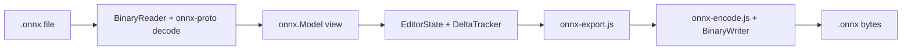

2026-06-08

Tags: [[ambarella]] [[netron]]
## exporting modified graphs in .onnx

### Notes

Netron could only export **PNG/SVG** (graph images) and **`.npy`** (tensor data). There was no way to save an edited model back to ONNX. This feature adds **round-trip export** for the editor’s **Modified** graph: metadata edits applied to the original model, then re-encoded as binary `.onnx`.

---

## Architecture

Export does **not** rebuild from the editor’s normalized copy. It:

1. Keeps a **pristine `ModelProto`** snapshot
2. Applies **delta changes** from the editor
3. **Validates** the result
4. **Encodes** to protobuf bytes

---

## 1. Protobuf write support — `source/protobuf.js`

- Added **`BinaryWriter`** (varint, fixed types, string/bytes, nested messages via `fork()` / `ldelim()`)
- Added **`storeUnknown()`** on readers so unknown protobuf fields are captured instead of dropped
- Updated all 30 ONNX binary `decode` default branches in `onnx-proto.js` from `skipType` → `storeUnknown`
- Added **`encodeUnknown()`** to re-emit unknown fields on encode
- Exported `BinaryWriter`, `encodeUnknown`, and `own` helper

---

## 2. ONNX encoders — `source/onnx-encode.js` (new)

- Added **`encode()`** for every message reachable from `ModelProto` (graph, nodes, attributes, tensors, types, functions, device/sharding messages, etc.)
- Added **`ModelProto.encodeBytes()`** as a one-step serializer
- Encoders mirror decode field numbers/wire types and avoid emitting prototype defaults when fields weren’t present

---

## 3. Export serializer — `source/onnx-export.js` (new)

- **`exportModifiedOnnx(model, editSession)`** — main API
- **`canExportOnnx(model)`** — checks export eligibility
- **`OnnxExportError`** — user-facing errors

**Supported editor changes:**

| Change                       | Behavior                                              |
| ---------------------------- | ----------------------------------------------------- |
| Node `name`                  | Updates `NodeProto.name`                              |
| Attribute add/modify/delete  | Maps editor types → `AttributeProto`                  |
| Value `name`                 | Renames across inputs/outputs/initializers/value_info |
| Value `type` / `description` | Updates or creates `ValueInfoProto`                   |

**Validation before write:**

- Dangling input references
- Duplicate names after renames
- Missing `op_type`
- Duplicate attribute names per node

**Bug fix (your `[object Object]` error):**

- View construction mutates `node.input`/`output` from strings to `{ name, initializer }` objects
- **Fix:** clone `ModelProto` in `onnx.Model` **before** view construction; export uses that pristine copy
- **Safety net:** `referenceName()` + `normalizeGraphReferences()` in the exporter

---

## 4. Model retention — `source/onnx.js`

- **`model.proto`** — immutable cloned `ModelProto` (for exportable binary models)
- **`model.exportable`** — `true` only for binary `.onnx` `ModelProto` (not ORT/text/JSON/raw GraphProto/offset models)
- Imports `onnx-encode.js` so cloning works at construction time

---

## 5. UI / host wiring

| Location             | Change                                                                                                    |
| -------------------- | --------------------------------------------------------------------------------------------------------- |
| `source/view.js`     | **File → Export Modified Model as ONNX...** (browser + Electron menu); `_canExportOnnx()`, `exportOnnx()` |
| `source/app.js`      | `export-onnx` command + save dialog with `.onnx` filter                                                   |
| `source/desktop.mjs` | IPC handler for `export-onnx` → `view.exportOnnx(file)`                                                   |

Image export (PNG/SVG) is unchanged. ONNX export is a **separate** menu item, enabled only when the model is exportable and an edit session exists.

---

## 6. Tests — `test/onnx_export.test.js` (new)

- Unmodified model round-trip (encode → decode)
- Modified node name + attribute export
- Export from pristine proto when the loaded graph was mutated for viewing (regression for `[object Object]`)
- Rejection when `exportable` is false

Run with: `node --test test/onnx_export.test.js`

---

## Limitations (by design)

- **Metadata only** — topology and weights unchanged
- **Binary `.onnx` ModelProto only** — not ORT, text, JSON, or raw GraphProto
- **Value `type`** — common tensor strings (e.g. `float32[1,3,224,224]`)
- **Semantic export** — not byte-for-byte identical to the original file (field order, default elision may differ)
- Unknown protobuf fields are preserved when captured at decode time

---

## Files touched (summary)

| File                       | Role                                           |
| -------------------------- | ---------------------------------------------- |
| `source/protobuf.js`       | Writer + unknown-field support                 |
| `source/onnx-proto.js`     | `storeUnknown` in all binary decoders          |
| `source/onnx-encode.js`    | **New** — all `encode()` methods               |
| `source/onnx-export.js`    | **New** — serializer, validation, API          |
| `source/onnx.js`           | Proto clone + `proto` / `exportable` accessors |
| `source/view.js`           | Menu + `exportOnnx()`                          |
| `source/app.js`            | Electron save dialog                           |
| `source/desktop.mjs`       | IPC wiring                                     |
| `test/onnx_export.test.js` | **New** — tests                                |
