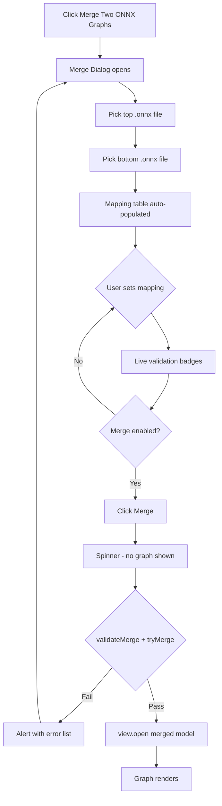
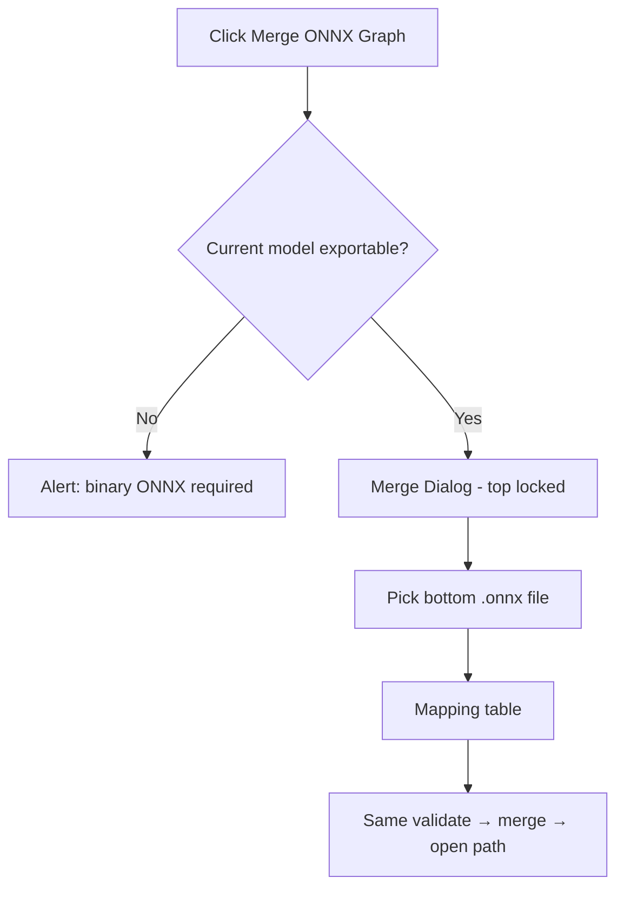
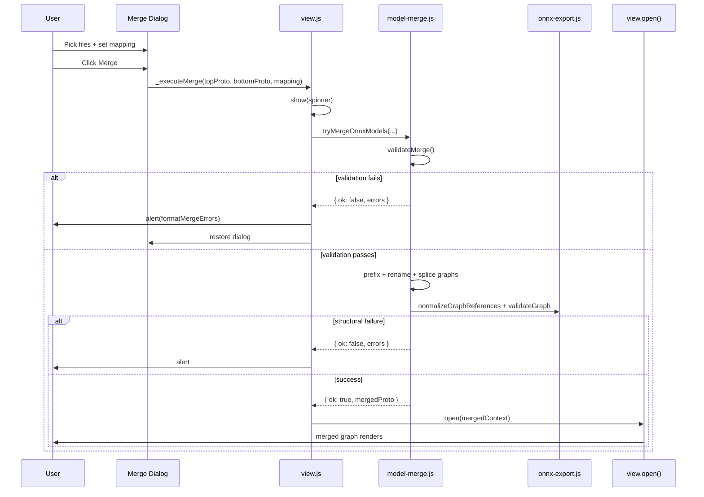

# ONNX Graph Merge — Full Feature Plan

## 1. Overview

### Goal
Allow users to chain two ONNX models **top → bottom** by connecting top `graph.output` tensors to bottom `graph.input` tensors via **explicit mapping**, producing a single merged model:

- **Inputs** = top model's `graph.input`
- **Outputs** = bottom model's `graph.output`
- **Junction** = shared tensor names between top outputs and bottom consumers

### Entry Points
| Entry | Label | Top model | Bottom model |
|-------|-------|-----------|--------------|
| Welcome screen | **Merge Two ONNX Graphs…** | User picks file | User picks file |
| File menu | **Merge ONNX Graph…** | Current open model | User picks file |

### Hard Rules
1. **Validate before render** — never call `view.open()` until merge succeeds
2. **Explicit mapping only** — no auto-match by name or position in v1
3. **Binary ONNX only** — requires `model.exportable && model.proto` (same gate as export)
4. **One shared merge pipeline** — both UI paths call the same `model-merge.js` functions

---

## 2. User Flows

### Flow A — Welcome Screen



### Flow B — Sidebar / Menu (model already open)



### Flow C — Cancel / Dismiss

- **Cancel** in dialog → close dialog, return to previous screen (welcome or open graph)
- **Alert OK** after failure → return to merge dialog with mapping preserved (do not re-pick files)

---

## 3. Core Merge Logic

### 3.1 Data Model

```js
// Mapping entry (explicit, user-defined)
{ top: string, bottom: string }

// Full merge options
{
  mapping: Array<{ top: string, bottom: string }>,
  bottomPrefix?: string,       // default: 'bottom_' if collisions detected
  strictShapes?: boolean,     // default: true
  allowSymbolicDims?: boolean // default: false in v1
}
```

### 3.2 Pipeline Steps

```
1. Load topProto, bottomProto (ModelProto)
2. validateMerge(topProto, bottomProto, mapping)     → errors/warnings
3. prefixBottomGraph(bottomGraph, reservedNames)     → resolve name collisions
4. applyMappingRenames(bottomGraph, mapping)         → bottom inputs → top output names
5. removeMappedBottomInputs(bottomGraph, mapping)    → drop internalized inputs
6. mergeGraphProtos(topGraph, bottomGraph)           → new GraphProto
7. mergeModelProtos(topProto, bottomProto, mergedGraph)
8. normalizeGraphReferences + validateGraph          → structural check
9. Return merged ModelProto
```

### 3.3 Graph Splice Rules

| Field | Merged result |
|-------|---------------|
| `graph.input` | Top's inputs only |
| `graph.output` | Bottom's outputs only |
| `graph.node` | `[...top.node, ...bottom.node]` |
| `graph.initializer` | Union of both (after rename/prefix) |
| `graph.sparse_initializer` | Union of both |
| `graph.value_info` | Union, dedupe by name (top wins on conflict) |
| Mapped bottom inputs | **Removed** from `graph.input` |

### 3.4 Rename / Connect (the splice)

For each mapping `{ top: T, bottom: B }`:

1. Rename every reference to `B` in the bottom graph → `T`
   - `node.input`, `node.output`
   - `graph.input`, `graph.output`, `graph.value_info`
   - `initializer.name`, sparse initializer names
   - `quantization_annotation.tensor_name`
2. Remove `graph.input` entry where `name === B` (after rename, entry would be `T` — remove before or skip adding)

After merge, bottom nodes that consumed `B` now reference `T`, which top nodes produce.

**Reuse:** adapt `renameInGraph()` from `source/onnx-export.js` (lines 235–268).

### 3.5 Name Collision Handling

Before concatenating nodes:

1. Collect all names in top graph (`collectGraphNames` pattern from `onnx-export.js`)
2. For each name in bottom graph that collides:
   - Prefix `node.name`, initializer names, intermediate tensor names
   - Default prefix: `bottom_`
3. Mapping refers to **original** bottom input names (before prefix)
4. Order: **prefix first → rename for mapping second**

Report collisions as warnings in validation; auto-prefix at merge time.

### 3.6 ModelProto Merge

```js
mergedModel = {
  ir_version: max(top.ir_version, bottom.ir_version),
  opset_import: mergeOpsetImports(top, bottom),  // max version per domain
  producer_name: 'netron-editor',
  producer_version: '<app version>',
  domain: top.domain || bottom.domain,
  model_version: max(top.model_version, bottom.model_version),
  doc_string: `Merged: ${topName} + ${bottomName}`,
  graph: mergedGraph,
  metadata_props: [...top.metadata_props, ...bottom.metadata_props],
}
```

`mergeOpsetImports`: for each domain, keep highest version. Warn if custom domains differ.

---

## 4. Validation Logic

### 4.1 Validation API

```js
export class MergeError extends Error {
  constructor(message, errors = []) {
    super(message);
    this.name = 'Merge Error';
    this.errors = errors;  // structured list
  }
}

export function validateMerge(topProto, bottomProto, mapping, options) {
  return { ok: boolean, errors: MergeIssue[], warnings: MergeIssue[] };
}

export function tryMergeOnnxModels(topProto, bottomProto, options) {
  const validation = validateMerge(...);
  if (!validation.ok) return { ok: false, errors: validation.errors };
  try {
    const mergedProto = mergeModelProtos(...);
    return { ok: true, mergedProto, warnings: validation.warnings };
  } catch (e) {
    return { ok: false, errors: [{ code: 'MERGE_FAILED', message: e.message }] };
  }
}
```

### 4.2 Issue Codes

| Code | Severity | Description |
|------|----------|-------------|
| `INVALID_MODEL` | error | Missing `graph` or not ModelProto |
| `NOT_ONNX` | error | Model not exportable / no proto |
| `NO_TOP_OUTPUTS` | error | Top graph has no outputs |
| `NO_BOTTOM_INPUTS` | error | Bottom graph has no inputs |
| `UNKNOWN_TOP_OUTPUT` | error | Mapping references missing top output |
| `UNKNOWN_BOTTOM_INPUT` | error | Mapping references missing bottom input |
| `UNMAPPED_BOTTOM_INPUT` | error | Bottom input not in mapping |
| `DUPLICATE_TOP_IN_MAPPING` | error | Same top output mapped twice |
| `TYPE_MISMATCH` | error | `elem_type` differs |
| `RANK_MISMATCH` | error | Different number of dimensions |
| `DIM_MISMATCH` | error | Static `dim_value` differs |
| `SYMBOLIC_MISMATCH` | error | `dim_param` vs `dim_value` conflict |
| `NON_TENSOR_IO` | error | sequence/map/optional/sparse at boundary |
| `UNKNOWN_TYPE` | error | Cannot resolve type for boundary tensor |
| `NAME_COLLISION` | warning | Node/initializer/tensor name exists in both |
| `EXTERNAL_WEIGHTS` | error | Initializer uses external data (v1 block) |
| `CUSTOM_FUNCTIONS` | warning | Model has `functions` (v1 skip merge of functions) |
| `DANGLING_REFERENCE` | error | Post-merge validateGraph failure |

### 4.3 Type Compatibility Check

Boundary types come from **`ValueInfoProto.type`** (`TypeProto.tensor_type`), not `TensorProto` directly.

**Resolution order** for each boundary name:
1. `graph.output` / `graph.input` entry
2. Same name in `graph.value_info`
3. Infer from producer node (top output) or first consumer (bottom input)

**Compare:**

```js
function areTypesCompatible(topType, bottomType, options) {
  // 1. Both must be tensor_type (v1)
  // 2. elem_type must match exactly
  // 3. If both shapes known: rank must match
  // 4. For each dim i: if both dim_value → must match
  // 5. If dim_param vs dim_value → fail unless allowSymbolicDims
  // 6. If shape missing on one side → warning, allow merge
}
```

### 4.4 Mapping Rules (v1 strict)

- Every bottom `graph.input` **must** appear exactly once in mapping
- Each top output used **at most once** in mapping
- Mapping count ≥ 1
- Top output does not need to be fully consumed if unmapped (unmapped top outputs are dropped from merged outputs — expected)

### 4.5 Post-Merge Structural Validation

Reuse from `onnx-export.js`:
- `normalizeGraphReferences(mergedGraph)`
- `validateGraph(mergedGraph)` — dangling inputs, duplicate attributes

---

## 5. UI Specification

### 5.1 Welcome Screen Button

**Location:** `source/index.html`, below "Open Model…"

```html
<button id="merge-onnx-button" class="center logo-button merge-onnx-button">
  Merge Two ONNX Graphs&hellip;
</button>
```

**CSS:**
- Same style as `.open-file-button`
- Position: `top: 220px` (below open button at 170px)
- Hide during `.welcome.spinner` (same as open button)

**Wiring:**
- `browser.js` — click → `view._startMergeWizard({ topModel: null })`
- `desktop.mjs` — same

---

### 5.2 File Menu Item

**Location:** `view.js` File menu, after "Export Modified Model as ONNX…"

```js
{
  label: 'Merge ONNX Graph...',
  execute: async () => await this._startMergeWizard({ topModel: this._model }),
  enabled: () => this._canMergeOnnx()
}
```

```js
_canMergeOnnx() {
  return this._model && this._model.exportable && this._model.proto;
}
```

---

### 5.3 Graph Properties Sidebar Action

**Location:** `TargetSidebar.render()` in `view.js`, when `target.type === 'graph'`

Add after outputs section:

```
── Actions ──
[ Merge ONNX Graph... ]   ← button
```

Only visible when `_canMergeOnnx()`.

Click → `_startMergeWizard({ topModel: this._view.model })`.

---

### 5.4 Merge Dialog

**Location:** New markup in `index.html` (mirror `save-dialog` pattern)

#### Layout

```
┌─────────────────────────────────────────────────────────┐
│  Merge ONNX Graphs                                   ✕  │
├─────────────────────────────────────────────────────────┤
│                                                         │
│  Top model                                              │
│  ┌─────────────────────────────────────┐  [ Browse… ]  │
│  │ backbone.onnx                       │               │
│  └─────────────────────────────────────┘                │
│                                                         │
│  Bottom model                                           │
│  ┌─────────────────────────────────────┐  [ Browse… ]  │
│  │ head.onnx                           │               │
│  └─────────────────────────────────────┘                │
│                                                         │
│  ── Connection mapping ──────────────────────────────  │
│                                                         │
│  Bottom input          →    Top output          Status  │
│  ┌──────────────────┐      ┌──────────────────┐         │
│  │ input_1       ▼  │      │ conv_out      ▼  │   ✓    │
│  ├──────────────────┤      ├──────────────────┤         │
│  │ input_2       ▼  │      │ logits        ▼  │   ✗    │
│  └──────────────────┘      └──────────────────┘         │
│                                                         │
│  ┌─ Summary ─────────────────────────────────────────┐ │
│  │ ✗ 1 incompatible pair                            │ │
│  │ ⚠ 1 unmapped bottom input                          │ │
│  └────────────────────────────────────────────────────┘ │
│                                                         │
│              [ Cancel ]              [ Merge ]          │
└─────────────────────────────────────────────────────────┘
```

#### Dialog States

| State | Top picker | Bottom picker | Merge button |
|-------|------------|---------------|--------------|
| Welcome flow, initial | Enabled | Disabled until top loaded | Disabled |
| Welcome flow, both loaded | Enabled | Enabled | Depends on validation |
| Sidebar flow | Disabled (shows current) | Enabled | Depends on validation |
| Validating | All disabled | — | Disabled |
| Merging (spinner) | Dialog hidden | — | — |

#### Mapping Table Behavior

- **Rows** = one per bottom `graph.input` (after bottom file loaded)
- **Columns:**
  - Bottom input name (read-only label)
  - Bottom type/shape hint (read-only, e.g. `float32 [1,768]`)
  - Dropdown: top outputs (populated after top loaded)
  - Top type/shape hint (updates on selection)
  - Status icon: ✓ compatible, ✗ incompatible, — unselected

- **Live validation:** on every dropdown change, call `validateMerge()` for current partial mapping; update summary + row badges
- **Merge button enabled when:**
  - Both models loaded
  - All bottom inputs mapped
  - Zero error-level issues
  - (Warnings OK with optional confirm — v1: allow with warnings, show in summary)

#### Hidden File Inputs

```html
<input type="file" id="merge-top-file-dialog" class="open-file-dialog" accept=".onnx">
<input type="file" id="merge-bottom-file-dialog" class="open-file-dialog" accept=".onnx">
```

---

### 5.5 Loading Models (without rendering)

```js
async _loadModelForMerge(file) {
  const context = new BrowserFileContext(this._host, file, [file]);
  const model = await this._modelFactoryService.open(context);
  if (!model.exportable || !model.proto) {
    throw new MergeError('Only binary .onnx models can be merged.');
  }
  return model;
}
```

**Do not call `view.open()`** for top/bottom during dialog — only hold `model.proto` in dialog state.

---

### 5.6 Merge Execution

```js
async _executeMerge(topProto, bottomProto, mapping) {
  const wasWelcome = !this._model;
  if (wasWelcome) {
    this.show('welcome spinner');
  } else {
    this.show('default'); // or overlay spinner on dialog
  }

  const result = tryMergeOnnxModels(topProto, bottomProto, { mapping });

  if (!result.ok) {
    if (wasWelcome) this.show('welcome');
    await this._host.message(formatMergeErrors(result.errors), true, 'OK');
    return; // dialog stays open if called from dialog
  }

  // Build context from merged bytes
  const bytes = onnx.ModelProto.encodeBytes(result.mergedProto);
  const context = /* in-memory context from bytes */;
  await this.open(context);

  this._host.document.title = buildMergeFilename(topName, bottomName);
  this._closeMergeDialog();
}
```

---

### 5.7 Error Display Format

```js
function formatMergeErrors(errors) {
  const lines = ['Cannot merge models.', ''];
  const mapping = errors.filter(e => e.top && e.bottom);
  const other = errors.filter(e => !e.top || !e.bottom);

  if (mapping.length) {
    lines.push('Mapping issues:');
    for (const e of mapping) {
      lines.push(`• ${e.bottom} ← ${e.top}: ${e.message}`);
    }
    lines.push('');
  }
  if (other.length) {
    lines.push('Other issues:');
    for (const e of other) {
      lines.push(`• ${e.message}`);
    }
  }
  return lines.join('\n');
}
```

Displayed via `_host.message(text, true, 'OK')` — uses existing `.alert` overlay.

---

## 6. Module Structure

### 6.1 `source/model-merge.js`

```js
// Errors
export class MergeError extends Error { ... }

// Boundary extraction
export function extractGraphOutputs(graph) → ValueInfo[]
export function extractGraphInputs(graph) → ValueInfo[]

// Type resolution
export function resolveValueType(graph, name) → TypeProto | null
export function formatType(type) → string  // "float32 [1,3,224,224]"

// Compatibility
export function areTypesCompatible(topType, bottomType, options) → { ok, reason }
export function validateMapping(topGraph, bottomGraph, mapping, options) → issues[]

// Graph operations
export function prefixBottomGraph(bottomGraph, prefix, reservedNames) → void
export function applyMappingRenames(graph, mapping) → void
export function removeMappedInputs(graph, mapping) → void
export function mergeGraphProtos(topGraph, bottomGraph, options) → GraphProto
export function mergeOpsetImports(topProto, bottomProto) → OperatorSetIdProto[]
export function mergeModelProtos(topProto, bottomProto, options) → ModelProto

// Public API
export function validateMerge(topProto, bottomProto, mapping, options) → { ok, errors, warnings }
export function tryMergeOnnxModels(topProto, bottomProto, options) → { ok, mergedProto?, errors?, warnings? }
export function formatMergeErrors(errors) → string
```

### 6.2 `source/view.js` additions

```js
_startMergeWizard({ topModel })       // entry point
_openMergeDialog(state)               // show dialog
_closeMergeDialog()
_onMergeTopFileSelected(file)
_onMergeBottomFileSelected(file)
_refreshMergeMappingTable()
_onMergeMappingChanged(rowIndex, topOutputName)
_updateMergeValidationSummary()
_executeMerge()
_canMergeOnnx()
_loadModelForMerge(file)
```

### 6.3 `source/index.html` additions

- `#merge-onnx-button` (welcome)
- `#merge-dialog` (modal)
- `#merge-top-file-dialog`, `#merge-bottom-file-dialog` (hidden inputs)
- CSS for `.merge-onnx-button`, `.merge-dialog`, mapping table

### 6.4 Dependencies (reuse, don't duplicate)

| From | Use |
|------|-----|
| `onnx-export.js` | `cloneModelProto`, `renameInGraph`, `collectGraphNames`, `normalizeGraphReferences`, `validateGraph` |
| `onnx-proto.js` | `ModelProto`, `GraphProto`, encode/decode |
| `export-filename.js` | merged filename pattern |
| `onnx.js` | `model.exportable`, `model.proto` |

---

## 7. Filename & Title

```js
// export-filename.js or model-merge.js
function buildMergeFilename(topName, bottomName) {
  const top = stripExtension(basename(topName));    // "backbone"
  const bottom = stripExtension(basename(bottomName)); // "head"
  return `${top}_merged_${bottom}.onnx`;
}
```

Set `this._host.document.title` after successful merge.

---

## 8. Edge Cases & v1 Scope

### In Scope (v1)
- Single graph per model (first/main graph only)
- Tensor-type boundaries only
- Explicit 1:1 mapping (one bottom input → one top output)
- Auto-prefix on name collision
- Binary in-memory ONNX (no external `.onnx.data`)
- Flat graphs (no If/Loop subgraph merge)

### Out of Scope (v1 — block or warn)
- External weight files
- Models with `functions` (custom ops as functions)
- Non-tensor I/O (sequence, map, optional)
- Multi-graph models (pick first graph, warn if more exist)
- Auto-mapping by name
- Partial bottom input passthrough (unmapped bottom inputs block merge)

### Future (v2+)
- Export prompt after merge
- Auto-suggest mapping by name + type match
- Support external data merge
- Merge into current edit session (with undo)
- Opset downgrade warnings with checker integration

---

## 9. Testing Plan

### 9.1 Unit tests — `test/model_merge.test.js`

| Test | Description |
|------|-------------|
| `compatible_single_pair` | 1 output → 1 input, matching float32 [1,3,224,224] |
| `elem_type_mismatch` | float32 vs float64 → error |
| `rank_mismatch` | [1,768] vs [1,768,1] → error |
| `dim_mismatch` | [1,512] vs [1,768] → error |
| `unmapped_bottom_input` | 2 bottom inputs, 1 mapped → error |
| `duplicate_top_mapping` | same top output twice → error |
| `name_collision_prefix` | Conv_1 in both → prefix + success |
| `multi_pair_mapping` | 2 outputs → 2 inputs |
| `validate_graph_passes` | merged result passes validateGraph |
| `round_trip_encode` | merge → encode → decode → node count correct |

Fixtures: extend `test/fixtures/onnx-shaped-mock.js` or minimal real ONNX bytes.

### 9.2 Manual UI tests

| Scenario | Expected |
|----------|----------|
| Welcome → merge two valid models | Graph renders, inputs=top, outputs=bottom |
| Welcome → incompatible types | Alert, no graph, dialog restorable |
| Open model → sidebar merge | Top locked, bottom picked, merge works |
| File menu merge | Same as sidebar |
| Cancel dialog | No change to current view |
| Non-ONNX model open → merge disabled | Menu/sidebar button greyed or hidden |
| Merge button disabled until valid mapping | Cannot click until all ✓ |

---

## 10. Implementation Phases

### Phase 1 — Core logic (no UI)
- [ ] Implement `model-merge.js` full API
- [ ] Unit tests for validation + merge
- [ ] Reuse `renameInGraph`, `validateGraph` from onnx-export

### Phase 2 — Merge dialog
- [ ] HTML/CSS for merge dialog + mapping table
- [ ] `_loadModelForMerge`, dialog state management
- [ ] Live validation badges

### Phase 3 — Welcome entry
- [ ] Welcome button + wiring (browser + desktop)
- [ ] Full two-file flow → merge → open

### Phase 4 — In-app entry
- [ ] File menu item
- [ ] Graph Properties sidebar button
- [ ] Top-locked sidebar flow

### Phase 5 — Polish
- [ ] Error message formatting
- [ ] Filename/title on merge
- [ ] Warnings in summary panel
- [ ] Manual QA with real models

---

## 11. Sequence Diagram (end-to-end)



---

## 12. File Change Summary

| File | Changes |
|------|---------|
| `source/model-merge.js` | **New** — all merge/validate logic |
| `source/view.js` | Merge wizard, dialog handlers, menu, sidebar button |
| `source/index.html` | Welcome button, merge dialog markup, CSS |
| `source/browser.js` | Welcome button click handler |
| `source/desktop.mjs` | Welcome button click handler |
| `source/export-filename.js` | Optional: `buildMergeFilename()` |
| `test/model_merge.test.js` | **New** — unit tests |

---

This document is the single reference for implementing the feature. Switch to **Agent mode** when you want to start with Phase 1 (`model-merge.js` + tests).