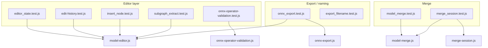

2026-06-17

Tags: [[ambarella]] [[netron]]
## overview of all tester files

Run any file with:

```bash
node --test test/<filename>.test.js
```

(`npm run test:editor` only runs `editor_state.test.js`. The main `npm test` path is Playwright + model validation, not these unit tests.)

Shared fixtures live in `test/fixtures/mock-graph.js` (simple Conv→Relu and Conv→Relu→Softmax chains) and `test/fixtures/onnx-shaped-mock.js` (ONNX-like graph shapes for adapter tests).

---

## 1. Core editor state & patching

### `editor_state.test.js` — largest file; tests `ModelEditor` end-to-end

Organized into **six `describe` blocks**:

| Section              | What it tests                            | How it works                                                                                                                        |
| -------------------- | ---------------------------------------- | ----------------------------------------------------------------------------------------------------------------------------------- |
| **EditorState**      | Clone, patch application, delta tracking | `ModelEditor.createSession(mockModel)` → `applyPatch(...)` → assert on `editor.modified`, `editor.delta`                            |
| **Node insertion**   | Insert above/below via patches           | Uses `mockChainModel`; patches with `changeType: 'add', property: 'insert'`; checks rewiring and delta remapping when indices shift |
| **Node deletion**    | Delete, rewire, safety checks            | `analyzeDeleteNode`, `canDeleteNode`, `deleteNode`, `findDanglingNodes`; Conv-with-weights vs merge-style bypass                    |
| **Value properties** | Custom attributes on tensor values       | `locateValueEntity` + patches on `entityType: 'value'`; reserved-name rejection; shared value identity                              |
| **ModelAdapter**     | Cloning ONNX-shaped graphs for editing   | `onnxShapedModel` fixture; BigInt normalization, getter fields, attribute schema preservation                                       |
| **BrowserSafety**    | Editor modules don’t import Node APIs    | Reads source files and regex-checks for `node:` imports                                                                             |

**Pattern:** create session → apply one or more patches → assert graph topology, delta states (`added`/`modified`/`deleted`/`unchanged`), and aggregate state on parent entities.

---

## 2. Undo / redo

### `edit-history.test.js` — tests `EditHistory` on `ModelEditor`

Four focused tests:

1. **Undo attribute add** — checkpoint → patch → undo → graph and delta restored  
2. **Redo rename** — undo then redo reapplies node name change  
3. **Undo delete** — deleted node comes back with correct name  
4. **Undo insert** — inserted node removed; delta entry cleared  

**Pattern:** `editor.history.checkpoint(editor)` before each edit, then `undo(editor)` / `redo(editor)`.

---

## 3. Low-level node insertion (graph surgery)

### `insert_node.test.js` — tests `insertNode()` directly (not via patches)

Three sections:

| Section                        | Focus                                                                                                         |
| ------------------------------ | ------------------------------------------------------------------------------------------------------------- |
| **insertNode above**           | Splicing data vs initializer inputs (Conv+W+B), unary chains, multi-input Add, dynamic slots, variadic Concat |
| **insertNode below**           | Output rewiring to downstream consumers                                                                       |
| **insertNode via ModelEditor** | Same Conv+weights case through `applyPatch`                                                                   |

**Pattern:** Builds small inline graphs (or `convWithWeightsGraph()`), calls `insertNode(graph, index, 'above'|'below', nodeSpec)`, asserts input/output tensor wiring. Uses `buildNodeFromMetadata` for schema-driven ops (Add, Concat).

This file complements `editor_state.test.js`’s “Node insertion” section but goes deeper on **wiring edge cases** (initializers, arity, variadic inputs).

---

## 4. Pre-insert validation (ONNX operator rules)

### `onnx-operator-validation.test.js` — tests `validateNodeInsert()`

Five tests around **warnings before insert**:

- Abs above Relu → no issues  
- And below unary Relu → `INSUFFICIENT_INPUTS`, `UNCONNECTED_INPUT`, `TYPE_MISMATCH`  
- And above single-input node → input wiring warnings  
- Add above node with two tensors in one slot → no false positives  

**Pattern:** `buildNodeFromMetadata(schema, name, graph)` + `validateNodeInsert(graph, index, position, schema, nodeSpec)` → inspect `issues[].code`.

---

## 5. Subgraph extraction

### `subgraph_extract.test.js` — tests `collectNodesBetween`, `extractSubgraph`, `replaceGraph`

| Test              | Behavior verified                            |
| ----------------- | -------------------------------------------- |
| Full chain slice  | All nodes from begin→end on `mockChainModel` |
| Partial slice     | Subset of chain                              |
| Unreachable end   | Throws `SubgraphExtractError`                |
| `extractSubgraph` | Boundary inputs/outputs named correctly      |
| `replaceGraph`    | Swapping graph clears delta tracker          |

**Pattern:** Operates on `mockChainModel.modules[0]` graph object; extraction tests check node names and boundary tensor names.

---

## 6. ONNX export

### `onnx_export.test.js` — tests `exportModifiedOnnx`, `rebuildGraphProtoFromModified`

Builds real `onnx.ModelProto` objects in-file (`buildMinimalModel`, `buildChainModel`) plus view-layer wrappers (`buildViewModel`).

| Test theme                 | What it verifies                                                         |
| -------------------------- | ------------------------------------------------------------------------ |
| Round-trip                 | Encode/decode minimal Identity model                                     |
| Modified export            | Renamed node + changed attribute → correct proto bytes                   |
| Pristine proto             | Export uses stored proto even if in-memory graph was mutated for viewing |
| Not exportable             | Throws `OnnxExportError`                                                 |
| After insert/delete        | Structural edits survive export                                          |
| Subgraph extract + rebuild | Extract → `replaceGraph` → export path                                   |

**Pattern:** `ModelEditor.createSession(viewModel)` → edits → `exportModifiedOnnx(viewModel, editor)` → decode bytes and assert on `graph.node`, names, tensor refs.

---

## 7. Export filename helpers

### `export_filename.test.js` — tests `source/export-filename.js`

Pure string utilities, no graph:

- `stripExportExtension`  
- `sanitizeExportBasename` (spaces, invalid chars)  
- `buildSubgraphExportBasename` (node names vs `_subgraph` fallback)  
- `normalizeExportFilename` (add `.onnx`, reject blank)  

---

## 8. Model merge (ONNX proto level)

### `model_merge.test.js` — tests `source/model-merge.js`

Uses in-file helpers `makeIdentityModel`, `buildMergePair()` to construct minimal upstream/downstream ONNX graphs.

| Section | Coverage |
|--------|----------|
| **model-merge** | `tryMergeOnnxModels`, `validateMerge` — compatible merge, type/rank/dim mismatch, unmapped inputs, duplicate mapping, name collision prefixing, encode round-trip, `formatMergeErrors` / `formatMergeWarnings` |
| **buildAutomaticMapping** | Single pair, exact name preference, multi-input mapping, ambiguity failures |
| **buildAutomaticMappingBidirectional** | Auto-detect which model is upstream |
| **detectMergeRoles** | Producer/consumer assignment, failed detection, tie-breaking (name matches, output count, slot preference) |

**Pattern:** Build protos → call merge/validate/mapping API → assert `result.ok`, error codes, mapping arrays, or formatted error strings.

---

## 9. Merge UI session state

### `merge_session.test.js` — tests `createMergeSession()` from `source/merge-session.js`

Same proto builders as `model_merge.test.js`, but tests the **session object** that backs the merge UI:

| Concern | Tests |
|--------|--------|
| Lifecycle | Pending until both slots loaded; `clearSlot` resets |
| Role detection | Auto-detect when both models load; re-detect on slot replace |
| `swapRoles` | Flips upstream slot; clears invalid mapping; respects `userOverridden` |
| Manual mapping | `updateMappingRow` → `mappingSource: 'manual'`, revalidation |
| Integration | Session mapping drives `tryMergeOnnxModels` successfully |

**Pattern:** `createMergeSession()` → `setSlotModel('A'|'B', slotEntry(proto, filename))` → assert `session.roleDetection`, `session.mapping`, `session.validation`, `session.canOpenMerged()`.

---

## How the files relate



- **`editor_state.test.js`** is the integration test for the editing stack (patch → delta → graph).  
- **`insert_node.test.js`** and **`onnx-operator-validation.test.js`** drill into specific operations the editor uses.  
- **`onnx_export.test.js`** closes the loop: edits → bytes on disk.  
- **`model_merge.test.js`** vs **`merge_session.test.js`**: same domain, different layers (pure merge logic vs UI session orchestration).
